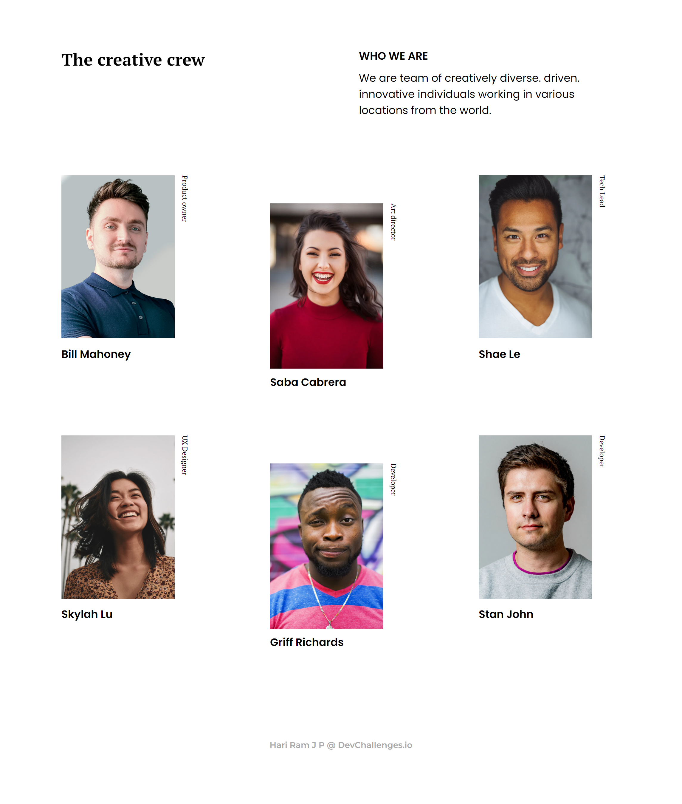
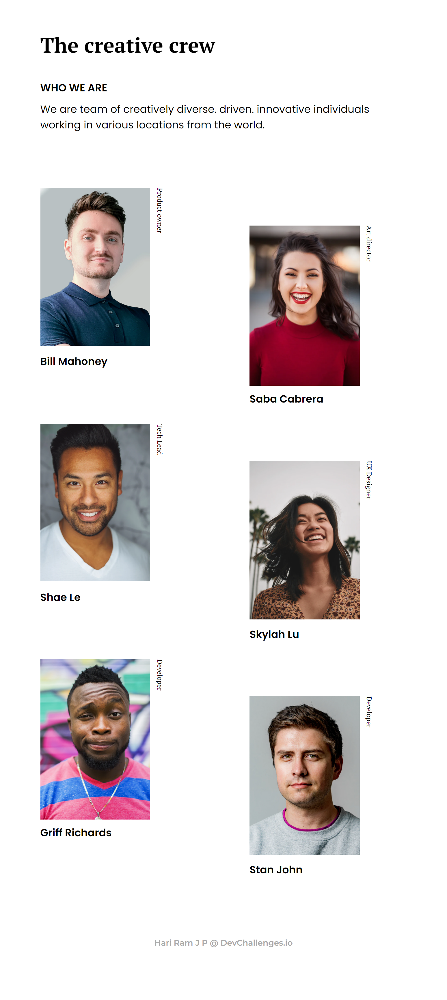
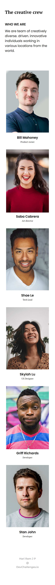

# DevChallenges.io

## Team Page [:link:][link]

### Screenshots

---

---

<table>
<tr>
<td></td>
<td></td>
</tr>
</table>

---

<!-- HTML content -->

Hari Ram J P

<a href="https://portfolio.devchallenges.io/hariramjp777" title="DevChallenges Profile">&nbsp;&nbsp;&nbsp;</a>

[link]: https://hariramjp777.github.io/frontend-team-page/ "Live Site"
[at1440px]: ./assets/designs/at1440px.png "At 1440px"
